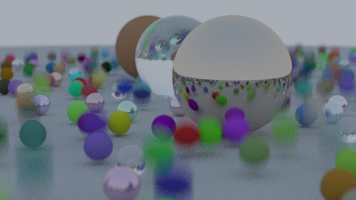
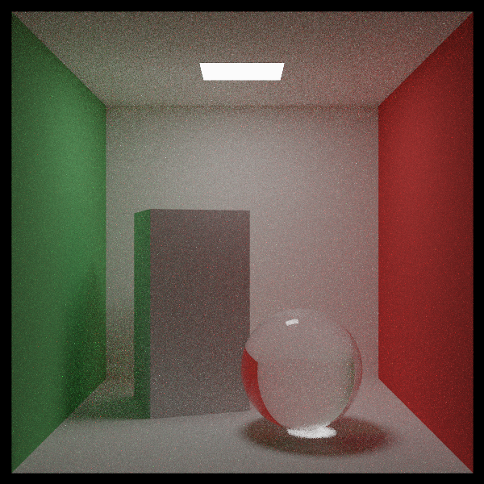
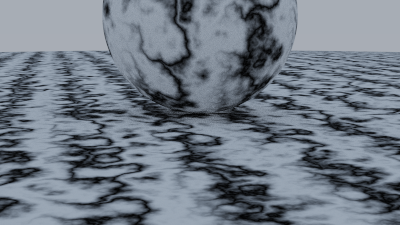
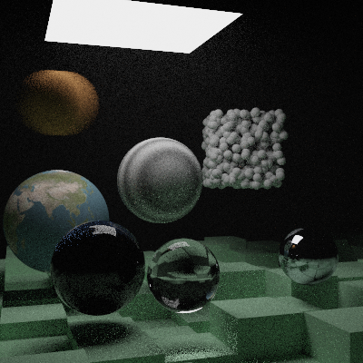

# miniRT: A Ray Tracer in C

A high-performance ray tracing renderer implemented in C, featuring advanced rendering techniques including BVH acceleration, multiple material types, texture mapping, and various geometric primitives.

## 🚀 Key Features:

- **Ray Tracing Engine**: Implements path tracing with multiple samples per pixel for high-quality rendering
- **Geometric Primitives**: Supports spheres, boxes, quads, and other hittable objects
- **Acceleration Structures**: BVH (Bounding Volume Hierarchy) for efficient ray-object intersection
- **Materials**: Lambertian, Metal, Dielectric, and Emissive materials with realistic light interaction
- **Textures**: Checkerboard, Perlin noise, and image-based textures
- **Lighting**: Area lights, environment lighting, and fog effects
- **Scenes**: Multiple predefined scenes including Cornell Box, Earth rendering, and complex final scenes
- **Multithreading**: Parallel rendering using thread pools for improved performance
- **Image Output**: Real-time display with MLX42 and optional PNG export

## 📸 Gallery:

The renderer includes several built-in scenes:

| Bouncing Spheres | Cornell Box |
| --- | --- |
|  |  |

| Perlin Spheres | Final Scene |
| --- | --- |
|  |  |

Example renders used by this README live in `docs/images/`. Runtime textures, such as the Earth projection, stay in `assets/`.

Approximate wall-clock render times for the example images:

| Scene | Example image | Time |
| --- | --- | ---: |
| Bouncing Spheres | `docs/images/bouncing_spheres.png` | ~105 sec (~1 min 45 sec) |
| Cornell Box | `docs/images/cornell_box.png` | ~41 sec |
| Perlin Spheres | `docs/images/perlin_noise.png` | ~2 sec |
| Final Scene | `docs/images/final_scene.png` | ~1375 sec (~23 min) |

These examples were rendered with 12 worker threads. The original filenames were based on process CPU time, which adds time across busy render threads; the values above are approximate wall-clock equivalents. The renderer now reports wall-clock time and uses the number of online CPU cores by default. Render time and image quality can be tuned per scene with `camera.samples_per_pixel` in `src/system/scene_setup.c`: higher values reduce noise and improve quality, but increase render time; lower values render faster with more visible noise.

- **Bouncing Spheres**: Animated spheres with different materials
- **Cornell Box**: Classic test scene with realistic lighting
- **Earth**: Texture-mapped sphere rendering the Earth
- **Final Scene**: Complex scene with multiple objects and lighting
- **Perlin Spheres**: Spheres with Perlin noise textures
- **Simple Light**: Basic lighting demonstration
- **Checkered Spheres**: Spheres with checkerboard patterns
- **Touching Spheres**: Spheres in contact with various materials

## 🛠️ Setup:

### Prerequisites:
- CMake 3.16.3 or higher
- GCC or compatible C compiler
- GLFW library
- Linux environment (dev container provided)
- Zero-Setup Environment: A complete `.devcontainer` is included. Just open this repo in GitHub Codespaces, and a virtual Linux desktop will automatically configure itself to display the graphics!

### Building:
```bash
mkdir build
cmake -S . -B build
cmake --build build --parallel
```

### Running:
```bash
./miniRT <scene-id|scene-name>
```

To watch chunks appear as they finish rendering, enable preview mode:
```bash
./miniRT --preview <scene-id|scene-name>
```

If you run `./miniRT` with no arguments, the program now prints a terminal-friendly usage guide and exits cleanly instead of rendering a default scene.

### Middle Ground (Great UX without the GUI):
If you want to give the user a great experience without building a graphical menu, use the terminal!

The app now behaves like a professional CLI tool: it shows a clear, color-coded error message, a `Usage` line, and a list of available built-in scenes.

## 🧬 Technical Challenges & Implementation

- **BVH Implementation**: Custom bounding volume hierarchy for ray acceleration
- **Material System**: Physically-based rendering with reflection, refraction, and emission
- **Thread Pool**: Custom thread pool implementation for parallel rendering
- **Random Sampling**: High-quality random number generation for Monte Carlo integration
- **Image Processing**: Efficient pixel manipulation and color space handling
- **Memory Management**: Careful allocation and deallocation of complex scene data

## 🗺️ Future Roadmap:

- Bidirectional and path space approaches such as Metropolis
- Add a glossy BRDF model
- Convert renderer from RGB to spectral
- Dynamic camera system (flying camera)
- Add torus as a hittable object

## 📚 Methodology & Acknowledgments

This project follows the architectural evolution outlined in Peter Shirley's Ray Tracing in a Weekend series. Built using modern C practices with CMake build system, leveraging MLX42 for graphics display and custom libraries for utility functions.
